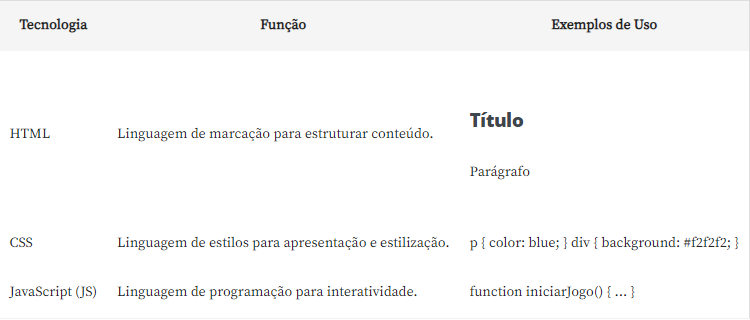

# [Curso de Lógica de programação: explore funções e listas](https://cursos.alura.com.br/course/logica-programacao-funcoes-listas)
Faça esse curso de Lógica de programação e:
- Aprenda o que são funções e como usar o JavaScript para manipular elementos na tela
- Desenvolva ainda mais sua lógica de programação inspirado num projeto real
- Saiba como usar o Github e Vercel para publicar seus projetos
- Descubra como utilizar listas, uma das principais estruturas de dados no mundo da programação
- Crie manipulações de palavras e números de forma dinâmica com JavaScript

---

# 1. Interagindo com HTML: O que aprendemos?
- Carregamos o projeto com o HTML e o CSS para criar a estrutura e o estilo da página que utilizaremos durante o curso;
- Aprendemos a manipular o conteúdo dos elementos HTML, como o H1 e o parágrafo (p), utilizando JavaScript para alterar dinamicamente o texto exibido na página;
- Entendemos a importância da interação entre o HTML e o JavaScript para criar páginas web dinâmicas e interativas.

## Código
```js
let titulo = document.querySelector('h1');
titulo.innerHTML = 'Jogo do número secreto';

let paragrafo = document.querySelector('p');
paragrafo.innerHTML = 'Escolha um número entre 1 e 10';

function verificarChute() {
    
}
```

## Para saber mais: diferenças entre html, css e Js
HTML, CSS e JavaScript (JS) são três tecnologias fundamentais para o desenvolvimento web.

O **HTML** (HyperText Markup Language) é a **linguagem de marcação** utilizada para estruturar o conteúdo de uma página web. Essa linguagem usa tags para definir a hierarquia dos elementos de uma página. Originado em 1991 por Tim Berners-Lee, o HTML é como o esqueleto de uma página web: trabalha organizando o conteúdo, como títulos, parágrafos, imagens e links, para que tudo fique bem arrumado e no lugar certo.

O **CSS** (Cascading Style Sheets), criado em 1995, é destacado como uma **linguagem de estilos**. Ele separa a apresentação da estrutura: é responsável pela apresentação e **estilização** dos elementos, pois permite controlar cores, fontes, layouts e outros aspectos visuais. É como vestir a estrutura HTML com roupas elegantes para que a página pareça exatamente como você deseja.

O **JavaScript**, por sua vez, é a única linguagem de programação das três. É responsável por adicionar **interatividade e dinamismo às páginas**. Possibilita a criação de funcionalidades como animações, validações de formulários e atualizações de conteúdo em tempo real.

O papel de cada tecnologia dessas na construção de aplicações web, de forma bem resumida, é: o HTML estrutura o conteúdo, o CSS define o estilo e o layout, e o JavaScript adiciona funcionalidades dinâmicas.



A aprendizagem dessas tecnologias é crucial para qualquer pessoa interessada em desenvolvimento web, uma vez que elas formam a base do ambiente digital. Compreender o HTML é necessário para estruturar e organizar o conteúdo de uma página de maneira semântica, o que é vital para a acessibilidade, indexação por motores de busca e uma experiência consistente entre diferentes dispositivos.

O CSS permite que pessoas desenvolvedoras controlem o design e a aparência de seus sites, possibilitando a criação de layouts atraentes e responsivos, que se adaptam a diferentes tamanhos de tela.

Por fim, o JavaScript capacita os desenvolvedores e as desenvolvedoras a criar experiências interativas e dinâmicas, e melhorar a usabilidade ao oferecer às pessoas usuárias funcionalidades mais avançadas.

A proficiência em HTML, CSS e JavaScript permite materializar ideias de maneira criativa e funcional, o que proporciona aos usuários finais uma experiência envolvente e intuitiva.

Além disso, essas habilidades são altamente valorizadas no mercado de trabalho, visto que a demanda por pessoas desenvolvedoras web qualificadas é constante, dada a importância contínua da presença online para empresas e indivíduos. Portanto, aprender e aprimorar essas tecnologias é um investimento significativo para qualquer pessoa que deseja se destacar na área de desenvolvimento web.

Para saber mais ainda sobre as características dessas três tecnologias a [Rafa Ballerini escreveu um artigo enfatizando essas diferenças.](https://www.alura.com.br/artigos/html-css-e-js-definicoes)

---

# 2. Funções: O que aprendemos?
- Criamos uma função em JavaScript que recebe 2 parâmetros para gerar um número aleatório e entendemos como usar a estrutura de uma função para encapsular um trecho de código reutilizável;
- Utilizamos a palavra-chave "return" dentro da função para retornar o valor do número aleatório gerado e criamos outra função chamada `exibirMensagemInicialNaTela` que não possui retorno nem parâmetros;
- Compreendemos a diferença entre funções com retorno e funções sem retorno e aprendemos como chamar e invocar a função para exibir uma mensagem inicial na tela;
- Vimos como os parâmetros e retornos são importantes para a comunicação entre funções e o restante do programa.

## Código
```js
let numeroSecreto = gerarNumeroAleatorio();

function exibirTextoNaTela(tag, texto) {
    let campo = document.querySelector(tag);
    campo.innerHTML = texto;
}

exibirTextoNaTela('h1', 'Jogo do número secreto');
exibirTextoNaTela('p', 'Escolha um número entre 1 e 10');

function verificarChute() {
    let chute = document.querySelector('input').value;

    console.log(gerarNumeroAleatorio());
    console.log('O botão foi clicado!');
    console.log(chute == numeroSecreto);
}

function gerarNumeroAleatorio() {
    return parseInt(Math.random() * 10 + 1);
}
```

## Para saber mais: funções com JavaScript
As funções desempenham um papel central na programação e no desenvolvimento de software, permitindo encapsular blocos de código reutilizáveis e executáveis. Elas podem ser definidas para executar tarefas específicas, desde cálculos simples até manipulação complexa de dados. As funções em JavaScript podem ter ou não parâmetros, bem como retornar ou não valores.


Seu uso é essencial para criar aplicações dinâmicas, interativas e eficientes em JavaScript. Porém, **você não precisa criar todos os tipos de funções neste momento**. Acompanhe as aulas e saiba que essas variações existem e conforme a necessidade, vamos mergulhando cada vez mais profundamente em lógica e JavaScript.

---

# 3. Reiniciando o jogo: O que aprendemos?
- Aprendemos como criar um programa para verificar se o “chute” inserido é igual ao número secreto definido. Utilizamos estruturas condicionais para tomar decisões com base no resultado dessa comparação;
- Criamos uma variável para armazenar a quantidade de tentativas realizadas pelo usuário;
- Vimos a importância de consultar a documentação da linguagem e das bibliotecas utilizadas no desenvolvimento do programa. A documentação é uma fonte valiosa de informações que nos auxilia na compreensão de conceitos e no uso correto das funcionalidades disponíveis.

## Código
```js
let numeroSecreto = gerarNumeroAleatorio();
console.log(numeroSecreto);
let tentativas = 1;

function exibirTextoNaTela(tag, texto) {
    let campo = document.querySelector(tag);
    campo.innerHTML = texto;
}

function exibirMensagemInicial() {
    exibirTextoNaTela('h1', 'Jogo do número secreto');
    exibirTextoNaTela('p', 'Escolha um número entre 1 e 10');
}

exibirMensagemInicial();

function verificarChute() {
    let chute = document.querySelector('input').value;
    let palavraTentativa = tentativas > 1 ? 'tentativas' : 'tentativa';
    let mensagemTentativa = `Você descobriu o número secreto com ${tentativas} ${palavraTentativa}!`;

    if (chute == numeroSecreto) {
        exibirTextoNaTela('h1', 'Acertou!');
        exibirTextoNaTela('p', mensagemTentativa);

        document.getElementById('reiniciar').removeAttribute('disabled');
    } else {
        if (chute > numeroSecreto) {
            exibirTextoNaTela('h1', 'Errou!');
            exibirTextoNaTela('p', 'O número secreto é menor que o chute!');
        } else {
            exibirTextoNaTela('h1', 'Errou!');
            exibirTextoNaTela('p', 'O número secreto é maior que o chute!');
        }
        tentativas++;
        limparCampo();
    }
}

function gerarNumeroAleatorio() {
    return parseInt(Math.random() * 10 + 1);
}

function limparCampo() {
    chute = document.querySelector('input');
    chute.value = '';
}

function reiniciarJogo() {
    numeroSecreto = gerarNumeroAleatorio;
    limparCampo();
    tentativas = 1;
    exibirMensagemInicial();
    document.getElementById('reiniciar').removeAttribute('disabled', true);
}
```

---

# 4. Listas: O que aprendemos?
- Aprendemos a melhorar o código existente, tornando-o mais eficiente e legível. Neste caso, refatoramos a função que realiza o sorteio do número secreto, tornando-a mais robusta e garantindo que o número sorteado não seja repetido;

## Código
```js
let listaDeNumerosSorteados = [];
let numeroLimite = 10;
let numeroSecreto = gerarNumeroAleatorio();
console.log(numeroSecreto);
let tentativas = 1;

function exibirTextoNaTela(tag, texto) {
    let campo = document.querySelector(tag);
    campo.innerHTML = texto;
}

function exibirMensagemInicial() {
    exibirTextoNaTela('h1', 'Jogo do número secreto');
    exibirTextoNaTela('p', 'Escolha um número entre 1 e 10');
}

exibirMensagemInicial();

function verificarChute() {
    let chute = document.querySelector('input').value;
    let palavraTentativa = tentativas > 1 ? 'tentativas' : 'tentativa';
    let mensagemTentativa = `Você descobriu o número secreto com ${tentativas} ${palavraTentativa}!`;

    if (chute == numeroSecreto) {
        exibirTextoNaTela('h1', 'Acertou!');
        exibirTextoNaTela('p', mensagemTentativa);

        document.getElementById('reiniciar').removeAttribute('disabled');
    } else {
        if (chute > numeroSecreto) {
            exibirTextoNaTela('h1', 'Errou!');
            exibirTextoNaTela('p', 'O número secreto é menor que o chute!');
        } else {
            exibirTextoNaTela('h1', 'Errou!');
            exibirTextoNaTela('p', 'O número secreto é maior que o chute!');
        }
        tentativas++;
        limparCampo();
    }
}

function gerarNumeroAleatorio() {
    let numeroEscolhido = parseInt(Math.random() * numeroLimite + 1);
    let quantidadeDeElementosNaLista = listaDeNumerosSorteados.length;

    if(quantidadeDeElementosNaLista == numeroLimite) {
        listaDeNumerosSorteados = [];
    }

    if (listaDeNumerosSorteados.includes(numeroEscolhido)) {
        return gerarNumeroAleatorio();
    } else {
        listaDeNumerosSorteados.push(numeroEscolhido);
        console.log(listaDeNumerosSorteados);
        return numeroEscolhido;
    }
}

function limparCampo() {
    chute = document.querySelector('input');
    chute.value = '';
}

function reiniciarJogo() {
    numeroSecreto = gerarNumeroAleatorio;
    limparCampo();
    tentativas = 1;
    exibirMensagemInicial();
    document.getElementById('reiniciar').removeAttribute('disabled', true);
}
```

## Para saber mais: vamos ler mais sobre listas?
Uma array no JavaScript é uma estrutura de dados que permite armazenar e organizar vários valores em uma única variável. Os valores em uma array podem ser de qualquer tipo de dado, como números, strings, objetos, outras arrays e assim por diante. As arrays em JavaScript são indexadas, o que significa que cada valor dentro dela é associado a um índice numérico, começando geralmente do índice 0.

### Criando uma array
Você pode criar uma array em JavaScript declarando uma variável e atribuindo-lhe valores entre colchetes ```[]```.
```js
let frutas = ["Maçã", "Uva", "Laranja"];
```

###  Acessando os valores
Os elementos de uma array são acessados usando índices numéricos, que começam em 0.


```js
console.log(frutas[0]); // Saída: "Maçã"
console.log(frutas[2]); // Saída: "Laranja"
```

### Adicionando novos elementos
Para adicionar um elemento ao final da array, você pode usar o método push.
```js
frutas.push("Morango");
console.log(frutas); // Saída: ["Maçã", "Uva", "Laranja", "Morango"]
```

### Removendo o último elemento
Para remover o último elemento, você pode usar o método pop.
```js
frutas.pop();
console.log(frutas); // Saída: ["Maçã", "Uva", "Laranja"]
```

### Quais linguagens de programação usam arrays?
Aqui está uma lista de algumas linguagens de programação que utilizam arrays:
- JavaScript
- Python
- Java
- C++
- C#
- Ruby
- PHP
- Swift
- Kotlin
- Go

Outras linguagens também suportam o uso de arrays ou estruturas de dados semelhantes para armazenar coleções de valores. Aprender sobre arrays é importante porque elas desempenham um papel fundamental no desenvolvimento de aplicações de software.

As listas ou Arrays fornecem uma maneira eficiente de armazenar e acessar conjuntos de dados, permitindo que os programadores organizem informações de forma lógica e manipulem esses dados de maneira eficaz.

Tendo o conhecimento de como trabalhar com arrays, é possível criar algoritmos mais poderosos, resolver problemas de programação de forma mais eficiente e criar aplicações mais dinâmicas e interativas.

---

# Referecências
### [1. Lógica de Programação Crie seus primeiros programas usando Javascript e HTML](https://www.casadocodigo.com.br/products/livro-programacao?_pos=1&_sid=4661f8240&_ss=r)
`Este livro apresenta uma abordagem totalmente prática. Uma didática pensada no iniciante, com a qual os conceitos são apresentados com motivações práticas, através do surgimento da necessidade para depois mostrar a solução.`

### [2. Lógica de programação com Portugol](https://www.casadocodigo.com.br/products/livro-portugol?_pos=2&_sid=4661f8240&_ss=r)
`Neste livro, Joice Mendes e Rafael Muniz apresentam todos os conceitos necessários para a criação da lógica de programação e dos algoritmos. Você vai aprimorar sua percepção lógica e aprender a aplicá-la na programação, cobrindo tópicos desde a sintaxe do Portugol, variáveis, comandos, estruturas condicionais, operadores relacionais e lógicos, estruturas de repetição, até vetores, matrizes e funções. O material é recheado com 85 exemplos de código, 55 exercícios de fixação com gabarito e um projeto prático ao longo do aprendizado. Todos os capítulos contam com um vídeo complementar disponibilizado na internet.`

### [3.Livro: "Estruturas de Dados e Algoritmos com JavaScript"](https://www.google.com.br/books/edition/Estruturas_de_dados_e_algoritmos_com_Jav/0nWKDwAAQBAJ?hl=pt-BR&gbpv=1&dq=estrutura+de+dados+javascript&printsec=frontcover)
`Este livro aborda de forma detalhada as estruturas de dados e algoritmos mais comuns, fornecendo exemplos práticos em JavaScript.`

### [4. Site: MDN Web Docs](https://developer.mozilla.org/pt-BR/)
`A documentação oficial da Mozilla Developer Network (MDN) é uma excelente fonte de informações sobre JavaScript. Lá você encontrará explicações detalhadas sobre a sintaxe, recursos da linguagem e exemplos de código.`

### [5. Eloquent JavaScript 3rd edition (2018)](https://eloquentjavascript.net/)
`Este é um livro sobre JavaScript, programação e as maravilhas do mundo digital. Um guia essencial para toda a pessoa desenvolvedora web. Em inglês.`

### [6. Algoritmos - Teoria e Prática, Thomas H. Cormen](https://books.google.com.br/books/about/Algoritmos_Teoria_e_Pr%C3%A1tica.html?id=6iA4LgEACAAJ&source=kp_book_description&redir_esc=y)
`Este livro apresenta um texto abrangente sobre o moderno estudo de algoritmos para computadores. É uma obra clássica, cuja primeira edição tornou-se amplamente adotada nas melhores universidades em todo o mundo, bem como padrão de referência para profissionais da área.`

### [7. JavaScript: O Guia Definitivo](https://www.amazon.com.br/JavaScript-Guia-Definitivo-David-Flanagan/dp/856583719X/ref=sr_1_1?keywords=javascript&qid=1701835643&sr=8-1&ufe=app_do%3Aamzn1.fos.6121c6c4-c969-43ae-92f7-cc248fc6181d)
`Referência completa para programadores, JavaScript: O guia definitivo fornece uma ampla descrição da linguagem JavaScript básica e das APIs JavaScript do lado do cliente definidas pelos navegadores Web. Recomendado para programadores experientes que desejam aprender a linguagem de programação da Web e para programadores JavaScript que desejam ampliar seus conhecimentos e dominar a linguagem, este é o guia do programador e manual de referência de JavaScript completo e definitivo.`

### [8. HTML5 e CSS3 Domine a web do futuro](https://www.casadocodigo.com.br/products/livro-html-css?_pos=2&_sid=ee24eb627&_ss=r)
`Neste livro você irá aprender a criar páginas elegantes de forma simples! HTML e CSS, quando bem utilizados, podem ser o sucesso de um projeto e, com os novos recursos, muito do que antes era trabalhoso agora não é mais.`

`Aprenda as melhores técnicas para escrever seu site por meio de exemplos práticos de funcionalidades úteis do cotidiano. Construa menus, aplique efeitos, estilize elementos visuais, melhore a semântica da sua página e muito mais!`

### [9. Guia Front-End O caminho das pedras para ser um dev Front-End](https://www.casadocodigo.com.br/products/livro-guia-frontend?_pos=5&_sid=ee24eb627&_ss=r)
`Neste livro, Diego Eis nos guia sobre o mundo de desenvolvimento web por meio de uma análise franca e objetiva de diversas tecnologias adotadas, necessidades do mercado e postura profissional. Você não vai aprender diretamente sobre essas tecnologias aqui, mas certamente vai desenvolver um senso mais apurado e uma nova forma de olhar para elas, o que é fundamental nesse mundo de aprendizado não linear.`
